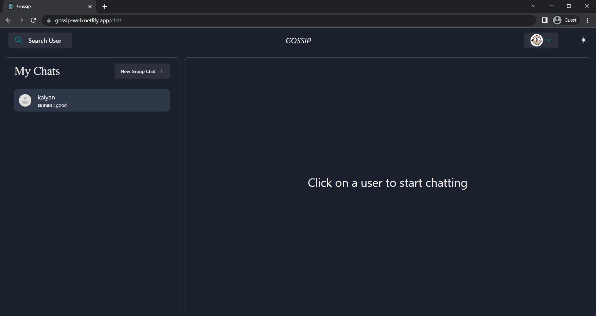
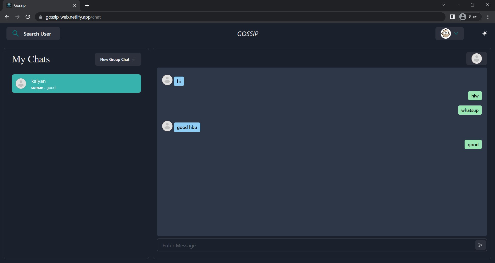
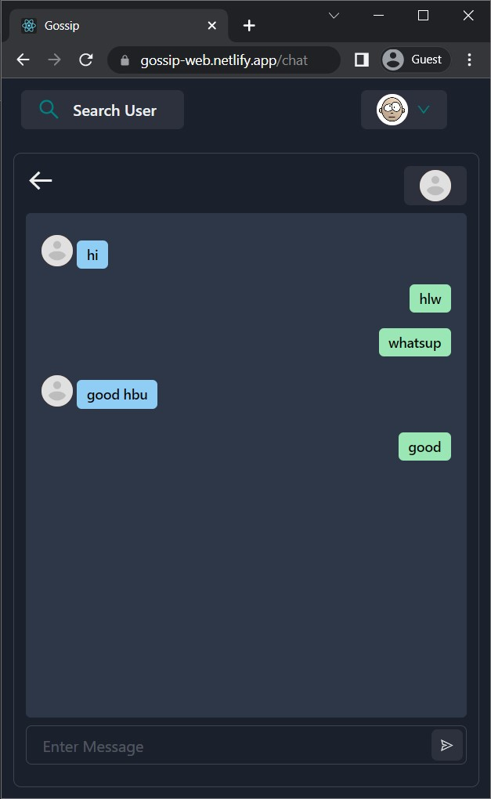

# GOSSIP - CHAT APP

This is a chat app which is built using sockets => supports real-time messages

## FEATURES

1. Signup / Signin
1. Search for users / create groups
1. One on one chat
1. Group Chat
1. Add members to group / exit from a group

## PICTURES

    
    
    

        
        
    

## TECH USED
1. SOCKETS
1. MONGODB
1. EXPRESS
1. NODE
1. REACT
1. CHAKRA UI

## AUTHORS

- [@superbsuman](https://www.github.com/superbsuman)

## DEMO

- [Click Here](https://gossip-web.netlify.app)